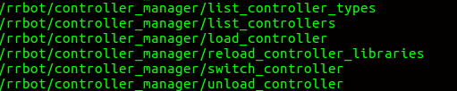
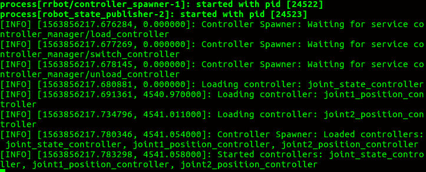
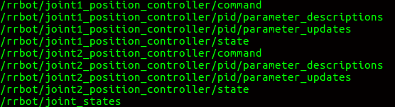

## 1.Adding the gazebo_ros_control plugin

**Function:** Parse the transmission tags and loads the appropriate hardward interfaces and controller manager.

```
<!-- ros_control plugin -->
<gazebo>
  <plugin name="gazebo_ros_control" filename="libgazebo_ros_control.so">
    <robotNamespace>/rrbot</robotNamespace>
    <robotSimType>gazebo_ros_control/DefaultRobotHWSim</robotSimType>
  </plugin>
</gazebo>

```

`<plugin>` specifies the plguin name to be loaded, which is libgazebo_ros_control.so.(Default).</br>
`<robotNamespace>` the ROS namespace to be used for this instance of th plugin, defaults to robot name in URDF/SDF.</br>
`<controlPeriod>` specifies the controller update rate.</br>
`<robotSimType>` specifies the type of robot hardward interfaces, defaults to "DefaultRobotHWSim", you can find the source code in the package "gazebo_ros_control".
### Lauch Gazebo
`roslaunch rrbot_gazebo rrbot_world.launch`
`rosservice list`



**OUTPUT: controller_manager should be loaded if common.**


**WHSY:**
```
<!--load the gazebo rosz-control plug in-->
<gazebo>
  <plugin name="balance_controller" filename="librobot_state_gazebo_ros_control_plugin.so">
    <robotNamespace>$(arg robot_namespace)</robotNamespace>
    <robotSimType>balance_controller/SimRobotStateHardwareInterface</robotSimType>
  </plugin>
</gazebo>

```
**ATTENTION:**
- He created his own custom robot hardward interface <SimRobotStateHardwareInterface> and gazebo_ros_control plugin <librobot_state_gazebo_ros_control_plugin>.

**QUESTION?:**

- How to modify the plugin fie <gazebo_ros_control_plugin.cpp>

## 2. Interfacing joint state controllers and joint position contrlloers to the joint

```
rrbot:
  # Publish all joint states -----------------------------------
  joint_state_controller:
    type: joint_state_controller/JointStateController
    publish_rate: 50  

  # Position Controllers ---------------------------------------
  joint1_position_controller:
    type: effort_controllers/JointPositionController
    joint: joint1
    pid: {p: 100.0, i: 0.01, d: 10.0}
  joint2_position_controller:
    type: effort_controllers/JointPositionController
    joint: joint2
    pid: {p: 100.0, i: 0.01, d: 10.0}
```
**ATTENTION:**
- To move each joint, we need to assign a ROS controller. In each joint, we need to attach a controller that is compatible with the hardware interface mentioned inside the transmission tags.
- The robot name should be the same as in the URDF file.


**WHSY:**
```
single_leg_controller:
  type: "balance_controller/SingleLegController"
  joints: ['front_left_1_joint', 'front_left_2_joint', 'front_left_3_joint']
  legs: ['LF_LEG']
  control_methods: ['contact_force']

base_balance_controller:
  type: "balance_controller/RosBalanceController"
  joints: ['front_left_1_joint', 'front_left_2_joint', 'front_left_3_joint', 'front_right_1_joint', 'front_right_2_joint', 'front_right_3_joint', 'rear_right_1_joint', 'rear_right_2_joint', 'rear_right_3_joint', 'rear_left_1_joint', 'rear_left_2_joint', 'rear_left_3_joint']
  front_left_1_joint/pid: {p: 300.0, i: 0.01, d: 3.0}
  front_left_2_joint/pid: {p: 300.0, i: 0.01, d: 3.0}
  front_left_3_joint/pid: {p: 300.0, i: 0.01, d: 3.0}
  front_right_1_joint/pid: {p: 300.0, i: 0.01, d: 3.0}
  front_right_2_joint/pid: {p: 300.0, i: 0.01, d: 3.0}
  front_right_3_joint/pid: {p: 300.0, i: 0.01, d: 3.0}
  rear_left_1_joint/pid: {p: 300.0, i: 0.01, d: 3.0}
  rear_left_2_joint/pid: {p: 300.0, i: 0.01, d: 3.0}
  rear_left_3_joint/pid: {p: 300.0, i: 0.01, d: 3.0}
  rear_right_1_joint/pid: {p: 300.0, i: 0.01, d: 3.0}
  rear_right_2_joint/pid: {p: 300.0, i: 0.01, d: 3.0}
  rear_right_3_joint/pid: {p: 300.0, i: 0.01, d: 3.0}
```
**ATTENTION:**
- custom controllers: SingleLegController, RosBalanceController


## 3. Launching the ROS contrllers with gazebo

The launch files start the Gazebo simulation of the arm, load the controller configuration, load the joint state controller and joint position controllers, and at last, it runs the robot state publisher, which publishes the joint states and TF.

```
<launch>

  <!-- Load joint controller configurations from YAML file to parameter server -->
  <rosparam file="$(find rrbot_control)/config/rrbot_control.yaml" command="load"/>

  <!-- load the controllers -->
  <node name="controller_spawner" pkg="controller_manager" type="spawner" respawn="false"
	output="screen" ns="/rrbot" args="joint_state_controller
					  joint1_position_controller
					  joint2_position_controller"/>

  <!-- convert joint states to TF transforms for rviz, etc -->
  <node name="robot_state_publisher" pkg="robot_state_publisher" type="robot_state_publisher"
	respawn="false" output="screen">
    <remap from="/joint_states" to="/rrbot/joint_states" />
  </node>

</launch>

```
**ATTENTION:**
- `args="joint_state_controller joint1_position_controller joint2_position_controller" ` specifies which controllers to be loaded, accoring to your controller configuration<control.yaml>

### roslaunch rrbot_control
`roslaunch rrbot_control rrbot_control.launch`

**OUTPUT:**</br>

## 4. Realtime

`rostopic list`



`FROM /ros_controllers/effort_controllers/joint1_position_controller.cpp`
```
// Start realtime state publisher
  controller_state_publisher_.reset( new realtime_tools::RealtimePublisher<control_msgs::JointControllerState>(n, "state", 1));

  // Start command subscriber
  sub_command_ = n.subscribe<std_msgs::Float64>("command", 1, &JointPositionController::setCommandCB, this);
```
**We can find that the topic "state" is realtime, but the topic "command" not.**


realtime_tools | |  | |
 - | - | - | - |
RealtimeBuffer | RealtimeBox | RealtimeClock | RealtimePublisher

LINK：http://docs.ros.org/jade/api/realtime_tools/html/annotated.html
